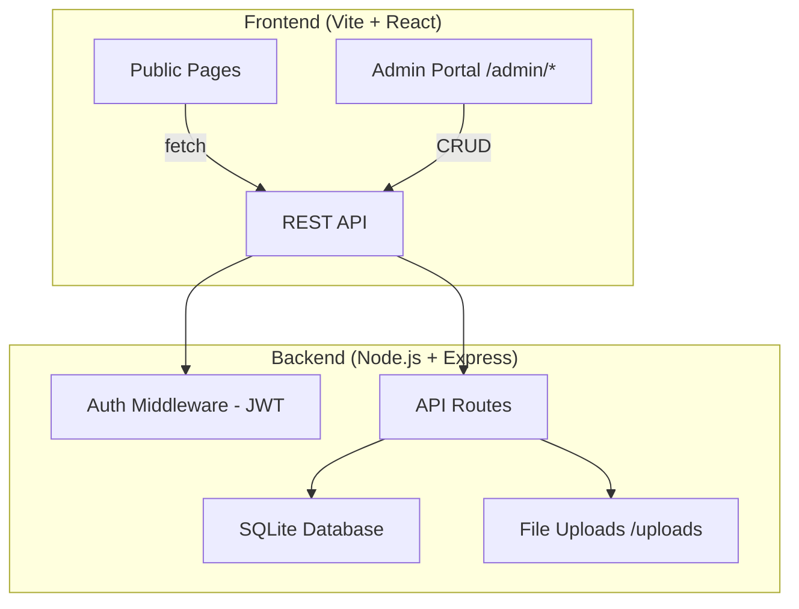

# CMS Admin Portal — Implementation Plan

Convert the static Dwindik portfolio into a CMS-powered website with a Node.js backend, so Dwindik can edit every piece of content from an admin dashboard — no code changes needed.

## Architecture Overview

**Stack choices:**
- **Backend**: Node.js + Express (as requested)
- **Database**: SQLite via `better-sqlite3` — zero config, single file, perfect for a personal portfolio
- **Auth**: JWT tokens with bcrypt password hashing
- **File Uploads**: Multer for image/video uploads
- **Frontend Admin**: React pages inside the existing Vite app, protected by auth

---

## User Review Required

> [!IMPORTANT]
> **Monorepo Structure**: The backend will live in a `server/` directory inside the same repo. The Vite frontend will proxy API requests to the backend during development. In production, you'd run both or use a reverse proxy (Nginx, etc). Is this okay, or do you want a separate repo?

> [!IMPORTANT]
> **Database Choice — SQLite**: For a personal portfolio CMS, SQLite is the simplest and most portable option (no database server needed). If you anticipate needing a hosted DB (e.g., for deployment on Vercel/Railway), we could switch to PostgreSQL or MongoDB. Which do you prefer?

> [!IMPORTANT]
> **Admin Credentials**: The admin login will be a single-user system (just Dwindik). We'll seed the DB with an initial username/password that can be changed from the admin panel. Sound good?

---

## Proposed Changes

### Component 1: Backend Server (`server/`)

This is the heart of the CMS — a Node.js + Express API server.

#### [NEW] [server/package.json](file:///Users/thewinlospodcast1/Documents/GitHub/cinematic-dwin-showcase/server/package.json)
- Dependencies: `express`, `better-sqlite3`, `bcryptjs`, `jsonwebtoken`, `multer`, `cors`, `dotenv`
- Dev dependencies: `nodemon`
- Scripts: `dev`, `start`, `seed`

#### [NEW] [server/.env](file:///Users/thewinlospodcast1/Documents/GitHub/cinematic-dwin-showcase/server/.env)
- `JWT_SECRET`, `PORT=5000`, `ADMIN_USERNAME`, `ADMIN_PASSWORD` (initial seed values)

#### [NEW] [server/index.js](file:///Users/thewinlospodcast1/Documents/GitHub/cinematic-dwin-showcase/server/index.js)
- Express app setup, CORS config, JSON body parser
- Static file serving for `/uploads`
- Mount route modules
- Error handling middleware

#### [NEW] [server/db.js](file:///Users/thewinlospodcast1/Documents/GitHub/cinematic-dwin-showcase/server/db.js)
- SQLite connection via `better-sqlite3`
- Auto-create tables on first run (migration-style)

**Database Tables:**

| Table | Purpose | Key Columns |
|-------|---------|-------------|
| `admin_users` | Auth | id, username, password_hash |
| `projects` | All portfolio projects | id, title, category, year, role, description, synopsis, thumbnail, youtube_id, director, producers, cast, status, sort_order, created_at |
| `about_content` | About page sections | id, section_key, content (JSON) |
| `site_settings` | Global settings | id, key, value |
| `hero_content` | Homepage hero config | id, brand_text, tagline, video_url, hero_image, hero_link |
| `categories` | Project categories | id, key, label, sort_order |

#### [NEW] [server/seed.js](file:///Users/thewinlospodcast1/Documents/GitHub/cinematic-dwin-showcase/server/seed.js)
- Creates default admin user (bcrypt hashed)
- Migrates all existing hardcoded projects from `projects.ts` into the DB
- Seeds about page content, hero content, site settings

#### [NEW] [server/middleware/auth.js](file:///Users/thewinlospodcast1/Documents/GitHub/cinematic-dwin-showcase/server/middleware/auth.js)
- JWT verification middleware
- Protects all `/api/admin/*` routes

#### [NEW] [server/routes/auth.js](file:///Users/thewinlospodcast1/Documents/GitHub/cinematic-dwin-showcase/server/routes/auth.js)
- `POST /api/auth/login` — validate credentials, return JWT
- `GET /api/auth/me` — return current user info (for session check)
- `PUT /api/auth/change-password` — update password (protected)

#### [NEW] [server/routes/projects.js](file:///Users/thewinlospodcast1/Documents/GitHub/cinematic-dwin-showcase/server/routes/projects.js)
**Public:**
- `GET /api/projects` — list all (with optional `?category=film` filter)
- `GET /api/projects/:id` — single project
- `GET /api/projects/latest?count=5` — latest projects

**Admin (protected):**
- `POST /api/admin/projects` — create
- `PUT /api/admin/projects/:id` — update
- `DELETE /api/admin/projects/:id` — delete
- `PUT /api/admin/projects/reorder` — drag-to-reorder

#### [NEW] [server/routes/content.js](file:///Users/thewinlospodcast1/Documents/GitHub/cinematic-dwin-showcase/server/routes/content.js)
**Public:**
- `GET /api/content/about` — about page content
- `GET /api/content/hero` — hero section config
- `GET /api/content/settings` — site settings (brand name, social links, email, etc.)
- `GET /api/content/categories` — list categories

**Admin (protected):**
- `PUT /api/admin/content/about` — update about page
- `PUT /api/admin/content/hero` — update hero section
- `PUT /api/admin/content/settings` — update site settings
- `POST /api/admin/categories` — add category
- `PUT /api/admin/categories/:id` — edit category
- `DELETE /api/admin/categories/:id` — delete category

#### [NEW] [server/routes/upload.js](file:///Users/thewinlospodcast1/Documents/GitHub/cinematic-dwin-showcase/server/routes/upload.js)
- `POST /api/admin/upload` — handle image/video upload via Multer
- Returns the public URL of the uploaded file
- Saves to `server/uploads/`

---

### Component 2: Frontend — API Layer & Data Migration

Replace all hardcoded data with API calls.

#### [NEW] [src/lib/api.ts](file:///Users/thewinlospodcast1/Documents/GitHub/cinematic-dwin-showcase/src/lib/api.ts)
- Base API client with `fetch` wrapper
- Auth token management (localStorage)
- Functions: `fetchProjects()`, `fetchProject(id)`, `fetchLatestProjects()`, `fetchAboutContent()`, `fetchHeroContent()`, `fetchSiteSettings()`, `fetchCategories()`

#### [MODIFY] [projects.ts](file:///Users/thewinlospodcast1/Documents/GitHub/cinematic-dwin-showcase/src/lib/projects.ts)
- **Remove** all hardcoded project data
- **Keep** TypeScript types/interfaces (they'll be shared)
- Export types only — data now comes from API

#### [NEW] [src/hooks/useProjects.ts](file:///Users/thewinlospodcast1/Documents/GitHub/cinematic-dwin-showcase/src/hooks/useProjects.ts)
- React Query hooks: `useProjects(category?)`, `useProject(id)`, `useLatestProjects()`, `useAboutContent()`, `useHeroContent()`, `useSiteSettings()`

#### [MODIFY] [Film.tsx](file:///Users/thewinlospodcast1/Documents/GitHub/cinematic-dwin-showcase/src/pages/Film.tsx) (and all category pages)
- Replace `getProjectsByCategory()` calls with `useProjects(category)` hook
- Add loading skeletons

#### [MODIFY] [Index.tsx](file:///Users/thewinlospodcast1/Documents/GitHub/cinematic-dwin-showcase/src/pages/Index.tsx)
- Replace `getLatestProjects()` with `useLatestProjects()` hook
- Fetch hero content from API (brand text, tagline, video URL)

#### [MODIFY] [About.tsx](file:///Users/thewinlospodcast1/Documents/GitHub/cinematic-dwin-showcase/src/pages/About.tsx)
- Fetch all about page text from API instead of hardcoded JSX
- Bio, craft section, production company info — all editable

#### [MODIFY] [ProjectDetail.tsx](file:///Users/thewinlospodcast1/Documents/GitHub/cinematic-dwin-showcase/src/pages/ProjectDetail.tsx)
- Replace `getProjectById()` with `useProject(id)` hook

#### [MODIFY] [Navbar.tsx](file:///Users/thewinlospodcast1/Documents/GitHub/cinematic-dwin-showcase/src/components/Navbar.tsx)
- Fetch social links and email from site settings API
- Menu items still static (they map to routes)

#### [MODIFY] [Footer.tsx](file:///Users/thewinlospodcast1/Documents/GitHub/cinematic-dwin-showcase/src/components/Footer.tsx)
- Fetch social links from site settings API

---

### Component 3: Admin Portal (Frontend)

A separate section of the React app at `/admin/*`, protected by login.

#### [NEW] [src/pages/admin/AdminLogin.tsx](file:///Users/thewinlospodcast1/Documents/GitHub/cinematic-dwin-showcase/src/pages/admin/AdminLogin.tsx)
- Cinematic login page matching the site's dark aesthetic
- Username + password form
- Stores JWT in localStorage on success

#### [NEW] [src/pages/admin/AdminLayout.tsx](file:///Users/thewinlospodcast1/Documents/GitHub/cinematic-dwin-showcase/src/pages/admin/AdminLayout.tsx)
- Sidebar navigation layout for admin pages
- Dark, premium UI consistent with the site aesthetic
- Links: Dashboard, Projects, About Page, Hero, Settings, Logout

#### [NEW] [src/pages/admin/AdminDashboard.tsx](file:///Users/thewinlospodcast1/Documents/GitHub/cinematic-dwin-showcase/src/pages/admin/AdminDashboard.tsx)
- Overview: total projects, projects by category, quick actions
- Recent projects list

#### [NEW] [src/pages/admin/AdminProjects.tsx](file:///Users/thewinlospodcast1/Documents/GitHub/cinematic-dwin-showcase/src/pages/admin/AdminProjects.tsx)
- Table/grid listing all projects
- Filter by category
- Create / Edit / Delete buttons
- Drag-to-reorder support

#### [NEW] [src/pages/admin/AdminProjectForm.tsx](file:///Users/thewinlospodcast1/Documents/GitHub/cinematic-dwin-showcase/src/pages/admin/AdminProjectForm.tsx)
- Full form for creating/editing a project
- Fields: title, category, year, role, description, synopsis, thumbnail (upload), youtube ID, director, producers, cast, status
- Image upload with preview
- Live preview of YouTube thumbnail from ID

#### [NEW] [src/pages/admin/AdminAbout.tsx](file:///Users/thewinlospodcast1/Documents/GitHub/cinematic-dwin-showcase/src/pages/admin/AdminAbout.tsx)
- Edit all about page sections:
  - Hero image, title, subtitle
  - Bio paragraphs
  - Craft quote
  - Craft skills (title + description pairs)
  - Production company info
  - Gallery images

#### [NEW] [src/pages/admin/AdminHero.tsx](file:///Users/thewinlospodcast1/Documents/GitHub/cinematic-dwin-showcase/src/pages/admin/AdminHero.tsx)
- Edit homepage hero:
  - Brand text (DWINDIK)
  - Tagline text (Cre8te)
  - Video URL
  - Hero image
  - Hero link

#### [NEW] [src/pages/admin/AdminSettings.tsx](file:///Users/thewinlospodcast1/Documents/GitHub/cinematic-dwin-showcase/src/pages/admin/AdminSettings.tsx)
- Site settings:
  - Contact email
  - Social media links (Instagram, YouTube, Twitter)
  - Copyright text
  - Change admin password

#### [NEW] [src/components/admin/ProtectedRoute.tsx](file:///Users/thewinlospodcast1/Documents/GitHub/cinematic-dwin-showcase/src/components/admin/ProtectedRoute.tsx)
- Auth guard — redirects to login if no valid JWT

#### [NEW] [src/components/admin/ImageUpload.tsx](file:///Users/thewinlospodcast1/Documents/GitHub/cinematic-dwin-showcase/src/components/admin/ImageUpload.tsx)
- Drag-and-drop image upload component
- Preview with remove option
- Connects to upload API

#### [NEW] [src/lib/adminApi.ts](file:///Users/thewinlospodcast1/Documents/GitHub/cinematic-dwin-showcase/src/lib/adminApi.ts)
- Admin-specific API functions (all include JWT header)
- `createProject()`, `updateProject()`, `deleteProject()`
- `updateAboutContent()`, `updateHeroContent()`, `updateSettings()`
- `uploadFile()`, `login()`, `changePassword()`

---

### Component 4: Configuration & Routing Updates

#### [MODIFY] [vite.config.ts](file:///Users/thewinlospodcast1/Documents/GitHub/cinematic-dwin-showcase/vite.config.ts)
- Add proxy config: `/api` → `http://localhost:5000`

#### [MODIFY] [App.tsx](file:///Users/thewinlospodcast1/Documents/GitHub/cinematic-dwin-showcase/src/App.tsx)
- Add admin routes:
  - `/admin/login` → AdminLogin
  - `/admin` → AdminDashboard (protected)
  - `/admin/projects` → AdminProjects (protected)
  - `/admin/projects/new` → AdminProjectForm (protected)
  - `/admin/projects/:id/edit` → AdminProjectForm (protected)
  - `/admin/about` → AdminAbout (protected)
  - `/admin/hero` → AdminHero (protected)
  - `/admin/settings` → AdminSettings (protected)

#### [MODIFY] [.gitignore](file:///Users/thewinlospodcast1/Documents/GitHub/cinematic-dwin-showcase/.gitignore)
- Add: `server/.env`, `server/uploads/`, `server/*.db`

---

## Content Model Summary

Everything Dwindik can edit from the admin portal:

| Section | What's Editable |
|---------|----------------|
| **Projects** | Title, category, year, role, description, synopsis, thumbnail, YouTube ID, director, producers, cast, status, ordering |
| **Homepage Hero** | Brand text, tagline, video file, hero image, link URL |
| **About Page** | Hero image, bio text (all paragraphs), craft quote, craft skills, production company info, gallery images, contact email |
| **Site Settings** | Contact email, social links, copyright text, admin password |
| **Categories** | Add/edit/remove project categories |

---

## Open Questions

> [!IMPORTANT]
> 1. **Deployment target** — Where will this be hosted? This affects whether SQLite is suitable or if we need a hosted DB. SQLite works great on traditional servers (DigitalOcean, VPS, Render) but not on serverless platforms (Vercel).
> 
> 2. **Image storage** — Should uploaded images be stored locally on the server (`server/uploads/`) or on a cloud service (Cloudinary, S3)? Local is simplest to start.
>
> 3. **Do you want the "Coming Soon" pages (Commercials, News, Internship) to also be CMS-editable?** Currently they're static placeholder pages. We could make them editable "custom pages" in the CMS too.

---

## Verification Plan

### Automated Tests
1. Backend API tests using the built-in `fetch` to test all CRUD endpoints
2. Seed script verification — ensure all existing project data migrates correctly
3. Auth flow tests — login, token refresh, protected routes

### Manual Verification
1. Start the backend server and confirm all API endpoints return data
2. Start the frontend and verify all public pages load data from the API (identical to current hardcoded version)
3. Log into admin portal, perform full CRUD cycle on projects
4. Test image upload flow
5. Edit about page content and verify it reflects on the public site
6. Browser test: navigate the admin portal end-to-end
